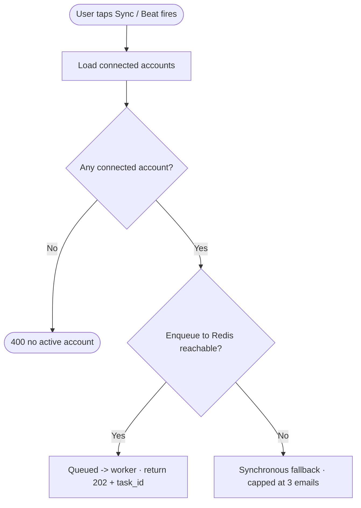

# Architecture

KRNL is a two-tier app: a **React PWA** talking to a **FastAPI backend** that syncs mail over
IMAP, extracts structured intelligence from it, and serves a sorted inbox, deadlines, and a
natural-language Q&A over the user's own mail.

```
 phone / browser ──HTTPS──►  Vercel (React PWA) ──REST──►  FastAPI backend
                                                            ├─ api      (uvicorn)
                                                            ├─ worker   (Celery + Beat)
                                                            └─ Redis    (queue / results)
                                                                 │
                       ┌─────────────────────────────────────────┼───────────────────────┐
                       ▼                     ▼                     ▼                        ▼
                 Supabase/Postgres      Qdrant vectors      Google Gemini            IMAP (institute mail)
                 (events, profiles,     (email chunks,      (extraction +            fetched newest-first,
                  subscriptions)         semantic search)    embeddings)              token encrypted at rest
```

## Components

| Layer | Tech | Responsibility |
|---|---|---|
| **PWA** | React, TypeScript, Vite | Inbox, Deadlines, Ask, Settings; service worker renders Web Push and enables install |
| **API** | FastAPI (Python 3.12) | Auth-gated REST: sync trigger, events, query, profile/interests, notifications |
| **Worker** | Celery + Redis | Async email sync; scheduled Beat jobs (auto-sync, reminders, weekly digest) |
| **Postgres** | Supabase | `events`, `profiles`, `connected_accounts`, `push_subscriptions`, `interest_catalog` |
| **Vectors** | Qdrant | Email body chunks (768-dim) for semantic retrieval and event matching |
| **Extraction** | Google Gemini | Per-email intelligence extraction + embeddings; answers for Ask KRNL |
| **Auth** | Supabase Auth | Google OAuth for the app; IMAP token (encrypted, Fernet) for mail |

## The sync pipeline

Sync runs on the worker. It fetches the newest emails, **dedupes by `Message-ID`** (so
re-syncs are idempotent and never re-spend the extraction budget), extracts structured event
data, stores it, and embeds the body for retrieval. A dedicated path detects **deadline
extensions** and merges them into the original event instead of creating a duplicate.

### Trigger



Redis up → async on the worker (up to 10 new/run). Redis down → a small synchronous fallback so
the HTTP request never hangs on the throttle.

### Per-email loop (the heart of it)

```mermaid
flowchart TD
    L([Next email]) --> M[message_id = get_message_id&#40;msg&#41;]
    M --> N{Already seen?}
    N -- Yes --> N1[skip · no extraction call] --> L
    N -- No --> P[Extract event intel · is_update / update_type / deadline]
    P --> Q{Deadline-extension update?}
    Q -- No --> U[insert as new event]
    Q -- Yes --> R[embed -> Qdrant search -> confirm match]
    R --> S{Matched + new deadline strictly later?}
    S -- Yes --> T[apply extension to original event · log history]
    S -- No --> U
    U --> Y[chunk body -> embed -> upsert vectors]
    Y --> L
```



**Four decisions that matter:**

| Decision | On "yes" | Effect |
|---|---|---|
| `message_id` already seen? | skip (no extraction) | idempotent re-syncs |
| Is this a deadline-extension? | try to merge | routes to matching instead of a plain insert |
| Matched event + later deadline? | apply extension | mutates the original event (forward-only) |
| Insert hit the unique constraint? | skip | hard dedup guard at the DB |

### Where data lands

| Data | Store | When |
|---|---|---|
| Event (name, deadline, summary, category, `message_id`, …) | Postgres `events` | every processed email |
| Deadline change log | Postgres `events.deadline_history` | only on an applied extension |
| Body chunks + 768-dim vectors | Qdrant | every processed email |
| Last sync timestamp | Postgres `connected_accounts.last_synced_at` | end of run |

## Priority & the Important tab

Each event gets a **personalized priority (0–100)**, computed per user and *boost-only* —
interests promote, never demote:

```
priority = max(importance, 0.4 · importance + 0.6 · relevance)
```

`importance` is the model's own consequence score (with a floor for clearly consequential
mail); `relevance` grades how many of the user's chosen interests the email's tags match.
A single shared `IMPORTANT_THRESHOLD` drives both the Important tab and notification triggers.
Users with no interests selected fall back to importance-only (graceful degrade).

## Ask KRNL (retrieval-augmented answers)

A question embeds → Qdrant returns the most relevant email chunks → structured event context
(deadlines, venues) is merged in → Gemini answers grounded in the retrieved mail, with
citations back to the source emails.

## Notifications

One `send_to_user` primitive (Web Push via `pywebpush`, prunes dead subscriptions on 404/410)
serves three triggers, each gated by per-user toggles:

- **Important / interest-matched mail** on sync
- **24h deadline reminder** (hourly Beat sweep; deadlines stored as naive IST wall-clock, so the
  window is computed in IST)
- **Weekly digest** (Beat, Sunday 18:00 IST)

## Scaling notes

The sync worker runs at `concurrency=1` with a per-email throttle, which serializes all
extraction calls under the free-tier rate limit. Raising concurrency multiplies the call rate
(the `sleep` throttle does **not** coordinate across worker processes), so horizontal scale
requires moving the throttle to a shared **Redis token bucket** first. See
[DECISIONS.md](DECISIONS.md) for the rate-limit math and the scale path.
